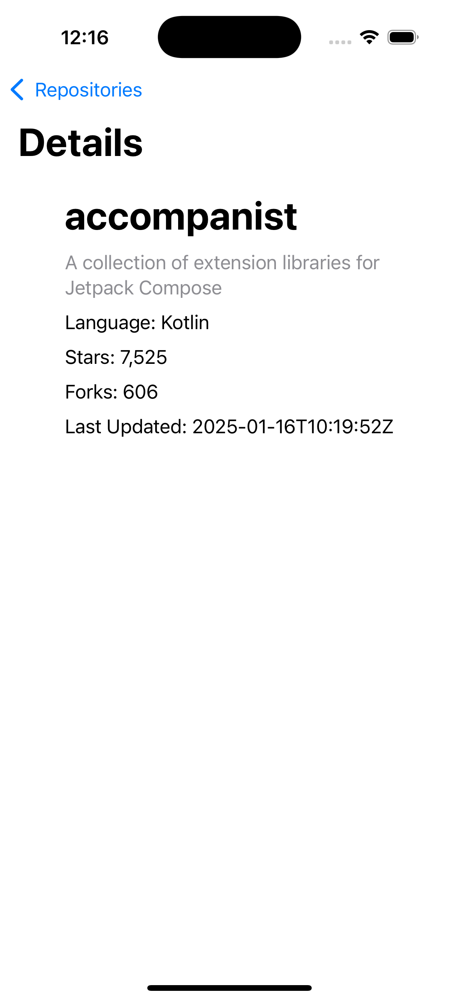
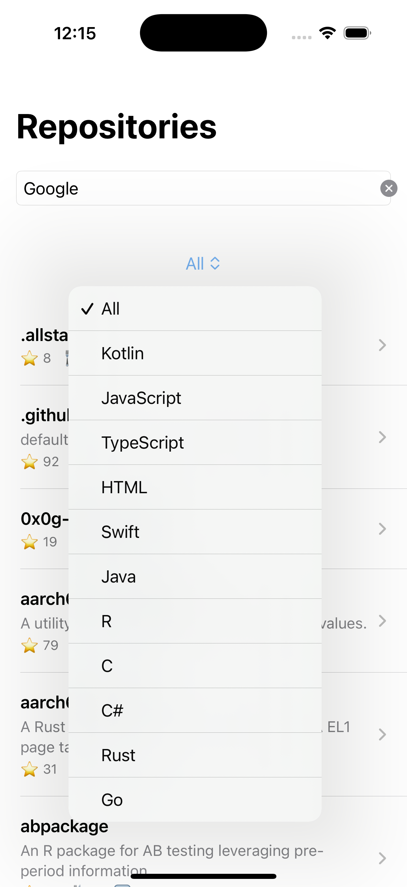

# GitHub Repositories App
## Overview
This is an iOS application built using Swift and SwiftUI that interacts with the GitHub API to fetch, display, and filter repositories for a specific GitHub user or organization.

---
## Features
* Fetch and display a list of repositories for a specific GitHub user or organization.
* Show repository details, including:
   * Name
   * Description
   * Programming Language
   * Number of Stars and Forks.

* Filter repositories by programming language.
* Load more repositories as the user scrolls (pagination).
* Handle API errors gracefully (e.g., invalid usernames, rate limits).
* Provide an intuitive and responsive UI.

---
## Requirements
* **iOS Version**: 15.0 or later
* **Xcode Version**: 14.0 or later
* **Swift Version**: 5.7 or later

---
## Setup Instructions
1. Clone this repository: `git clone <your-repo-link>

 2.    Open the project in Xcode:
 `

cd <project-folder>
open GitHubRepositories.xcodeproj

```
3.    Build and run the app:
•    Select a simulator or device.
•    Press Cmd + R or click the Run button.
```
How to Use
1.    Enter a GitHub username in the search bar (e.g., facebook, google).
2.    View the list of repositories for that username.
3.    Use the Filter by Language dropdown to filter repositories.
4.    Scroll to the bottom of the list to load more repositories.
5.    Tap on a repository to view additional details.

## Screenshots

### Home Screen


### Filtered View


### Detail View


### Search View


### No Results Found


### Network Error


### Language Filter


### Video Demo
[Video Recording of App](media/video_recording_of_app.mov)
Known Issues
•    The app may display errors if the GitHub API rate limit is exceeded.
•    Some test cases for invalid usernames and pagination are not included.

Dependencies
•    Combine framework for handling asynchronous requests.
•    SwiftUI for building the user interface.

Possible Future Enhancements
•    Add caching for repository data to minimize API requests.
•    Enhance error messages for better user experience.
•    Implement real-time search with a debounce feature.

License

This project is licensed under the MIT License. 

---
